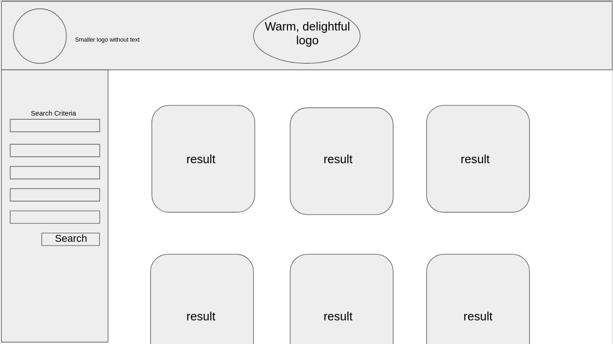

# Pet Adoption Website

## Overview

A pet adoption website for a fictitious clinic, built using HTML,CSS, and JavaScript.

Clients will be able to search for cats and dogs near them, and several options will be available to pare down results. The search field will make a call to PetFinder's REST API and display any available results.

For flex goals I would also like to be able to schedule an appointment to come in to see your prospective pet.

## Capstone Features Utilized

1. Features List 1
   - Use arrays, objects, sets or maps to store and retrieve information that is displayed in your app.
   - Analyze data that is stored in arrays, objects, sets or maps and display information about it in your app.
   - Analyze text and display useful information about it. (e.g. word/character count in an input field) (Flex goal)

2) Features List 2
   - Retrieve data from a third-party API and use it to display something within your app.

3) Features List 3 (All Flex Goals)
   - Create a node.js web server using a modern framework such as Express.js or Fastify.  Serve at least one route that your app uses (must serve more than just the index.html file).
   - Interact with a database to store and retrieve information (e.g. MySQL, MongoDB, etc).
   - Develop your project using a common JavaScript framework such as React, Angular, or Vue.
   - Persist data to an external API and make the stored data accessible in your app (including after reload/refresh).

## Technical Insight

The base project is slated to be in HTML, CSS, & JavaScript, but the flex goals include Node.js, Express.js, React, TypeScript, and MongoDB. Copies of the API I intend to use are available on [Kaggle](https://kaggle.com/) as datasets that I will be converting into my own version of PetFinder's API.

## Visual Aids

Wireframe also available as a slide on [Google Slides](https://docs.google.com/presentation/d/1nMcmpV7EO3OM8W7ElyNf1-NySdHAW5SoRhP-MKwYYmA/edit?usp=sharing)