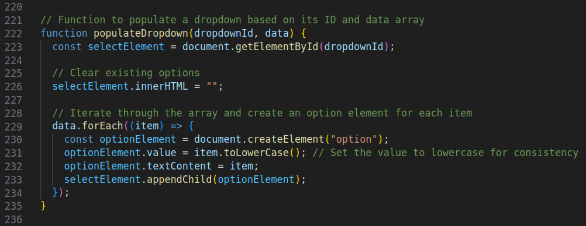
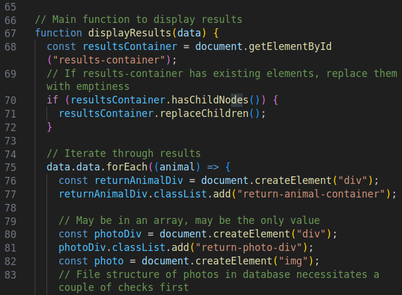
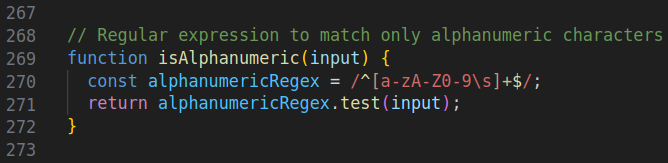
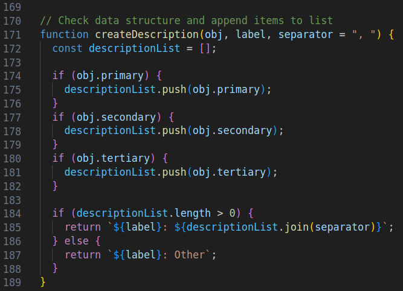
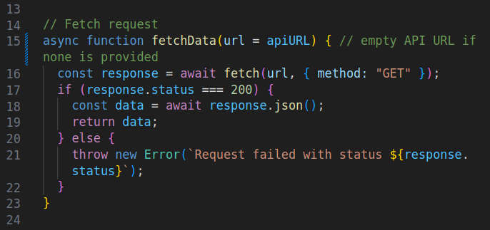
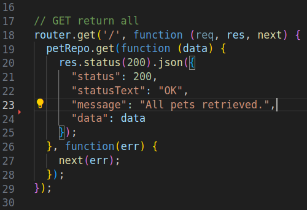
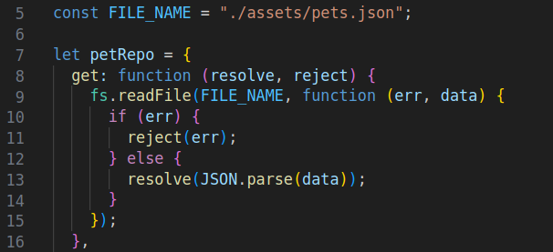

# Project Review

## For the administration of Code: You

Below are several examples of web development capstone feature fulfillment, organized in the descending order they are presented in the Code: You requirement documentation.

I had a lot of fun creating this, and learned more than I thought I possibly could in such a brief period of time. It is my hope you enjoy reviewing my work in the same spirit.

## Feature Implementation:

### Capstone Features 1

1. Use arrays, objects, sets or maps to store and retrieve information that is displayed in your app.
    - All information in the drop down selectors are loaded from arrays stored in js/dropdownArrays.js
    - This data is retrieved from a function named populateDropdown in js/search.js on line 222
    - 
2. Analyze data that is stored in arrays, objects, sets or maps and display information about it in your app.
    - Search results are generated from objects holding their various types of information
    - This data is used to generate the various attributes and image of each result in a function in js/search.js on line 66
    - 
3. Use a regular expression to validate user input and either prevent the invalid input or inform the user about it (in all cases prevent invalid input from being stored or saved).
    - Search input only allows alphanumeric characters
    - Function isAlphanumeric is in js/search.js on line 268
    - 
4. Create a function that accepts two or more input parameters and returns a value that is calculated or determined by the inputs.  Basic math functions don’t count (e.g. addition, etc).
    - Function createDescription takes API JSON data and creates a list to display on the page
    - Input generates up to three items separated by a comma by default, and returns the items prefixed with which attribute they represent
    - Function is in js/search.js on line 171
    - 

### Capstone Features 2

1. Retrieve data from a third-party API and use it to display something within your app.
    - The API is served by Express.js and data was originally scraped from Petfinder.com
    - Pushing search initiates the API call function in js/search.js on line 15
    - 

### Capstone Features 3

1. Create a node.js web server using a modern framework such as Express.js or Fastify.  Serve at least one route that your app uses (must serve more than just the index.html file).
    - The controller is index.js
    - An example of a GET all router function is on line 18
    - The middleware is located in repos/petRepo.js
    - An example of the same get all function is on line 7
    - The [deploy-replit](https://github.com/keith-flynn/pet-adoption-website/tree/deploy-replit) branch of this repository serves the front end through [GitHub Pages](https://keith-flynn.github.io/pet-adoption-website/), and the Express.js router is hosted by [Replit.com](https://replit.com/) for your convenience 
    - 
    -     